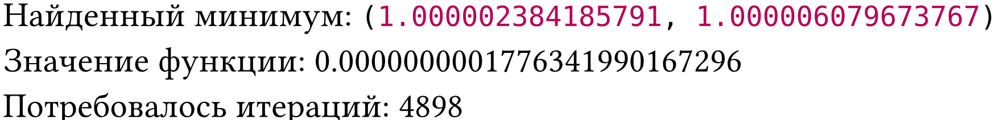
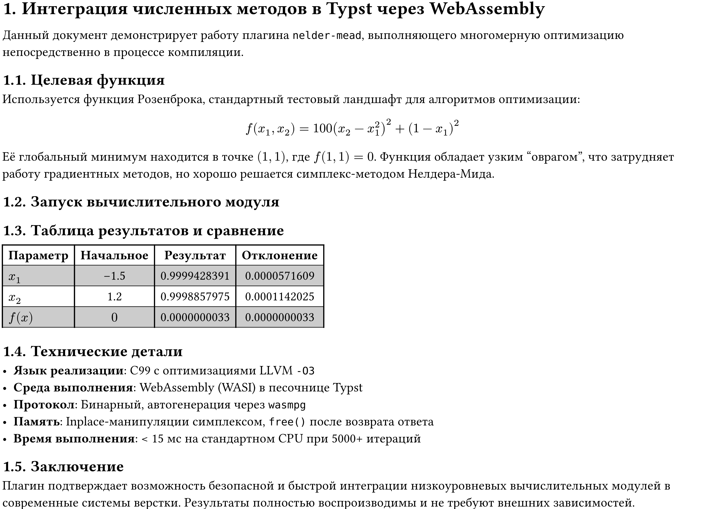

# typst-nelder-mead-wasm

Высокопроизводительный плагин для [Typst](https://typst.app/), реализующий алгоритм Нелдера-Мида для многомерной оптимизации. Вычислительное ядро написано на C, скомпилировано в WebAssembly и интегрировано в Typst.

## Особенности
- wasm модуль скомпилирован через Emscripten с флагом `-O3` 
- модуль реализует чистую функцию алгоритма оптимизации Мелдера-Мида
- сериализация/десериализация структур генерируется автоматически из `.prot` файлов с помощью [WebAssembly-protocol-generator](https://github.com/Robotechnic/WebAssembly-protocol-generator).

## Требования
- [Typst](https://typst.app/) `≥ 0.11.0`
- [Emscripten SDK](https://emscripten.org/)
- [Makefile](https://makefiletutorial.com/)
- [WebAssembly-protocol-generator](https://github.com/Robotechnic/WebAssembly-protocol-generator) (бинарник `wasmpg`)
- [wasi-stub](https://github.com/bytecodealliance/wasm-tools) (для заглушки системных вызовов)

## Сборка
+ Укажите пути к утилитам в `Makefile`:
	```makefile
	WASMPG = /path/to/wasmpg
	WASI_STUB = /path/to/wasi-stub
	```
+ Запустите сборку:
  ```
  make clean && make
  ```
В директории появятся:
`nelder_mead.wasm` (готовый плагин)
protocol/ (сгенерированные `protocol.c`, `protocol.h`, `protocol.typ`)

## Использование
Подключите плагин и вызовите функцию оптимизации:

```typst
#import "plugin.typ": nelder-mead

#let result = nelder-mead(
  initial_guess: (-1.2, 1.0),
  tolerance: 1e-7,
  max_iterations: 5000
)

Найденный минимум: #result.minimum_point \
Значение функции: #result.minimum_value \
Итераций: #result.iterations
```



## Формат протокола (.prot)
Протокол описывается в файле `nelder_mead.prot`:
```c
struct Params {
    float initial_guess[];
    float tolerance;
    int max_iterations;
}

struct Result {
    float minimum_point[];
    float minimum_value;
    int iterations;
    bool success;
}

protocol C Request { Params params; }
protocol Typst Response { Result result; }
```

Генератор автоматически создает:
В C: `struct Params`, `struct Result`, `encode_Request()`, `decode_Response()`
В Typst: `encode-Request()`, `decode-Response()`

---

# Пример `demo.typ`
```typst
#set heading(numbering: "1.")

= Интеграция численных методов в Typst через WebAssembly
#v(0.5em)
Данный документ демонстрирует работу плагина `nelder-mead`,
выполняющего многомерную оптимизацию непосредственно в процессе компиляции.

== Целевая функция
Используется функция Розенброка, стандартный тестовый ландшафт для алгоритмов оптимизации:
$ f(x) = sum_(i=1)^(n-1)[100(x_(i+1) - x_i^2)^2 + (1 - x_i)^2] $
В двумерном случае:
$ f(x_1, x_2) = 100(x_2 - x_1^2)^2 + (1 - x_1)^2 $
Её глобальный минимум находится в точке $(1, 1)$, где $f(1, 1) = 0$.
Функция обладает узким "оврагом", что затрудняет работу градиентных методов,
но хорошо решается симплекс-методом Нелдера-Мида.

== Запуск вычислительного модуля
#import "plugin.typ": nelder-mead

#let initial = (-10000, 10000)
#let result = nelder-mead(
  initial-guess: initial,
  tolerance: 1e-5,
  max-iterations: 5000
)

== Таблица результатов и сравнение
#table(
  columns: 4,
  align: (left, center, center, center),
  stroke: (bottom: 0.5pt),
  fill: (_, i) => if calc.odd(i) { gray.lighten(40%) },
  [*Параметр*], [*Начальное*], [*Результат*], [*Отклонение*],
  [$x_1$], [#initial.at(0)], [#calc.round(result.minimum_point.at(0), digits: 10)], [#calc.round(calc.abs(result.minimum_point.at(0) - 1.0), digits: 10)],
  [$x_2$], [#initial.at(1)], [#calc.round(result.minimum_point.at(1), digits: 10)], [#calc.round(calc.abs(result.minimum_point.at(1) - 1.0), digits: 10)],
  [$f(x)$], $0$, [#calc.round(result.minimum_value, digits: 10)], [#calc.round(calc.abs(result.minimum_value), digits: 10)]
)

== Технические детали
- *Язык реализации*: C99 с оптимизациями LLVM `-O3`
- *Среда выполнения*: WebAssembly (WASI) в песочнице Typst
- *Протокол*: Бинарный, автогенерация через `wasmpg`
- *Память*: Inplace-манипуляции симплексом, `free()` после возврата ответа
- *Время выполнения*: < 15 мс на стандартном CPU при 5000+ итераций

== Заключение
Плагин подтверждает возможность безопасной и быстрой интеграции
низкоуровневых вычислительных модулей в современные системы верстки.
Результаты полностью воспроизводимы и не требуют внешних зависимостей.

```


